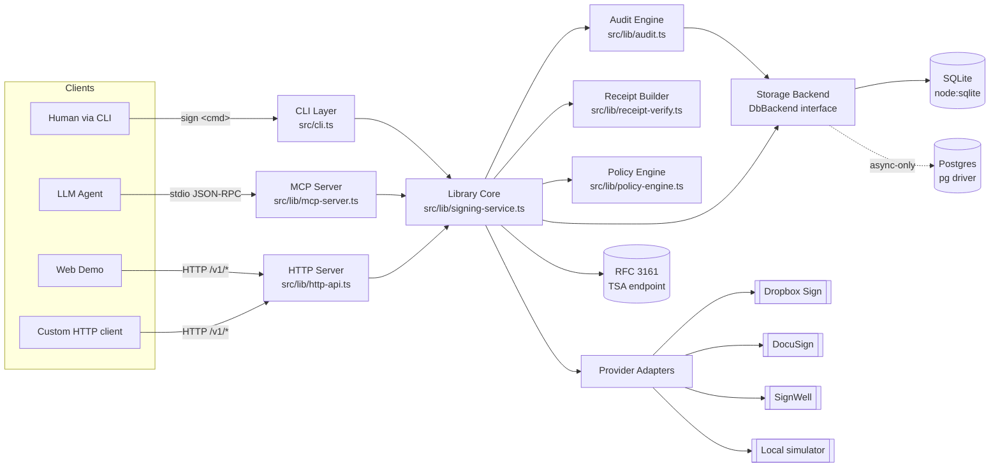

# Architecture

A diagrammatic walkthrough of the moving parts. Skim this once if you're
trying to decide whether `sign-cli` fits your workflow; come back when you
need to know where to look for a specific behavior.

## At a glance



## Layer-by-layer

### 1. Clients

There are four ways to drive the CLI:

| Client | Surface | Use case |
|---|---|---|
| Human | CLI (`sign …`) | Direct ops, demos, scripts |
| LLM agent | MCP over stdio | Inside Claude Desktop, Continue.dev, langchain, custom agents |
| Web demo | HTTP `/web-demo/*` | Operator dashboard for tracking pending signatures |
| Custom HTTP | `POST /v1/*` | Non-MCP services that want the same surface |

The HTTP and MCP surfaces dispatch to the **same handlers** in the library
core — there's no behavior that's only available in one. That's intentional:
it means a fix lands once and reaches every client.

**Preflight.** `sign doctor` is the canonical "is this environment healthy?"
entry point — it does not touch any client surface, only the local
environment (node + sqlite versions, provider config, DB path, writability,
local signer key). Agents should call it first; humans can run it whenever
something feels off. Output is `{ ok, checks[] }` with stable check names and
hints. See [`docs/agent-guide.md`](agent-guide.md) for the per-check schema.

**Provider banner.** Every command that resolves a provider prints
`[sign] resolved provider: <p> (<source>)` to stderr on start. With
`--strict-provider true` (or `SIGN_STRICT_PROVIDER=true`), a mismatch
between the resolved provider and a request's persisted provider fails
with `STRICT_PROVIDER_MISMATCH` before any state mutation.

### 2. Library core

Everything below the entry points is plain async TypeScript: no globals,
no implicit env reads inside hot paths. Tests can drive it directly.

The core has three pillars:

- **`signing-service.ts`** — the lifecycle. `createSigningRequest` →
  `sendSigningRequest` → `signSigningRequest` → `fetchFinalSignedPdf`. Every
  state transition appends to the audit chain.
- **`audit.ts`** — the chain itself. Every event is a `{event_type,
  payload_json, hash_prev, hash_self}` row, and the SQLite triggers reject
  UPDATE/DELETE on `audit_events` so the chain is append-only by
  construction (PL/pgSQL equivalent on Postgres).
- **`policy-engine.ts`** — the declarative spec a `signer policy run-watch`
  loop evaluates against each new inbox entry. Pure function: `(spec, ctx) →
  decision`.

### 3. Storage abstraction

`DbBackend` (in `src/lib/db-backend.ts`) is a tiny interface — `prepare`,
`prepareAsync`, `exec`, `execAsync`, `close`. Two implementations:

- `SqliteBackend` — wraps `node:sqlite`'s `DatabaseSync`. Default.
- `PostgresBackend` — wraps `pg.Pool`. Async-only (pg has no sync API).
  Translates SQLite-style `?` placeholders to `$1, $2…` on the fly.

The async migration is incremental: the read-only audit primitives
(`verifyAuditChainAsync`, `listAuditEventsAsync`, `searchAuditEventsAsync`)
plus the write primitives (`appendAuditEventAsync`, `tryClaimWebhookEventAsync`,
`insertApprovalRowAsync`, `insertArtifactRowAsync`, `markApprovalUsedAsync`,
`markAllRequestApprovalsUsedAsync`, `updateRequestStatusAsync`,
`reissueApprovalTokenRowAsync`, `persistRequestProviderMetadataAsync`) all
work against Postgres today.

`sign db postgres-smoke` is the integration probe: bootstrap → insert →
extend chain → verify → list → search, all through `PostgresBackend`. Run
it after `sign db migrate-postgres` to confirm a fresh deployment.

### 4. Provider adapters

Each external e-sign provider is a thin shim that maps the core lifecycle
verbs to that provider's API. The local provider is a fully in-process
simulator that produces real PAdES-signed PDFs (signed by a self-issued
cert from `data/local-keys/`) so you can verify the entire chain end-to-end
without any signup.

### 5. RFC 3161 anchoring

`audit anchor` snapshots every chain head and gets a single TSA timestamp
over the digest. Re-running over time produces a continuity proof:
tampering with any old chain breaks the digest in every later anchor that
covered it. `audit verify-anchor` and `audit chain-bundle verify` do the
re-check.

### 6. Bundles + receipts

`audit export` produces a self-contained handoff bundle. As of
**bundleVersion 2** the layout is:

```
<out>/
├─ audit.json                       request + full event chain
├─ signed.pdf                       the signed PDF (when available)
├─ original.pdf                     unsigned source, byte-identical to input
├─ manifest.json                    every file's sha256 + bytes
├─ README.md                        human-readable handoff + verify commands
└─ receipts/
   ├─ <signer-a-email>.json         only A's events (B's are not included)
   └─ <signer-b-email>.json         only B's events (A's are not included)
```

Per-signer receipts are isolated by construction (filtered by
`payload.signerEmail` before serialization), so one signer's bundle can be
shared without leaking another's. `request export-receipt` /
`request verify-receipt` continue to emit + consume the older
**bundleVersion 1** for backward compatibility.

## Where to read next

- **[`docs/recipes/`](recipes/)** — narrative walkthroughs (sign as Alice, weekly anchor, auditor handoff, agent loop).
- **[`docs/compliance-posture.md`](compliance-posture.md)** — what the audit chain does and doesn't prove.
- **[`MIGRATION.md`](../MIGRATION.md)** — the storage / async migration roadmap.
- **`sign --catalog json`** — machine-readable command + flag catalog (every command, every flag, with descriptions).
